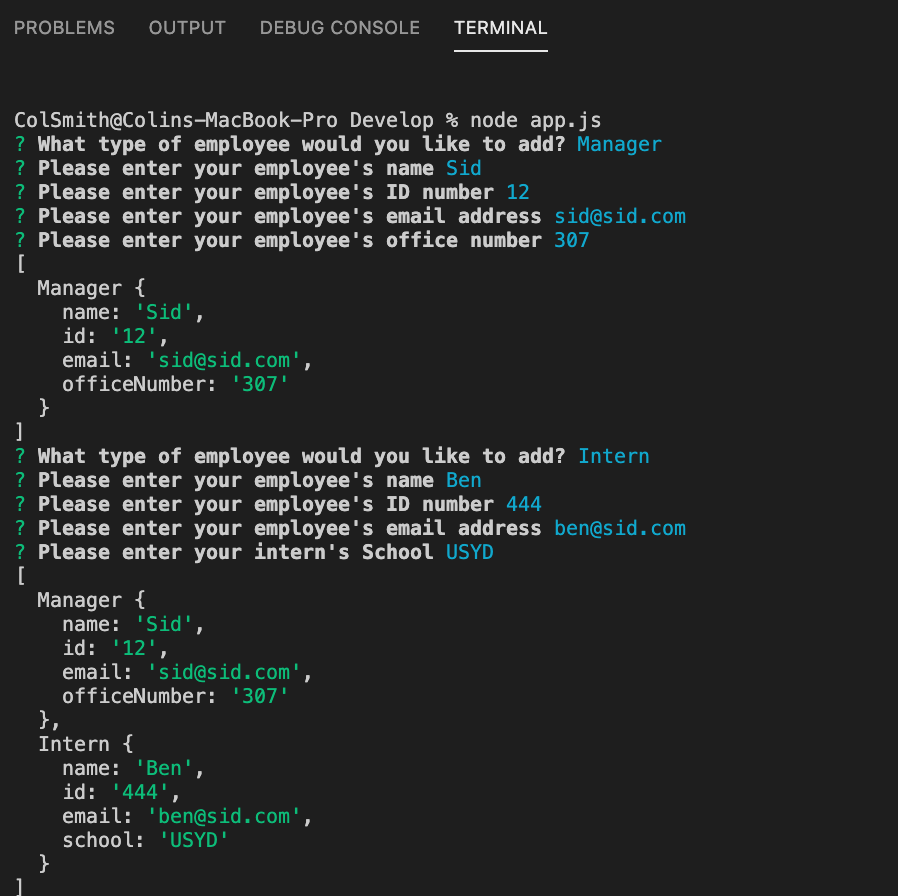
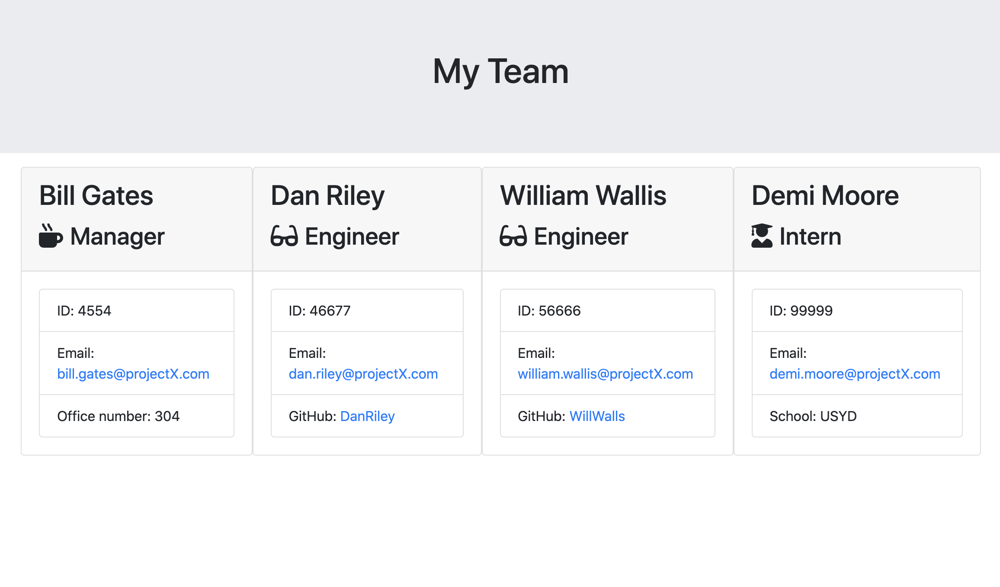

# Organisation Chart Generator

## Motivation
This project enables Managers to build a team chart with all their colleagues' key information.

## Installation
To run this tool, perform an npm install (npm i) in your terminal.  Then run node.js using 'node app.js'. 

## Project Usage:
Once installed, the user will be prompted to answer a series of questions about their team.  When they have finished adding team members, an HTML page will be created with the team members. 

## Test instructions:
The GitHub repository contains a 'test' folder with a series of test scripts.

## Contributions:
Git pull

## For any questions:
GitHub/ColJCSmith https://www.github.com/ColJCSmith 
email: colinjcsmith@gmail.com